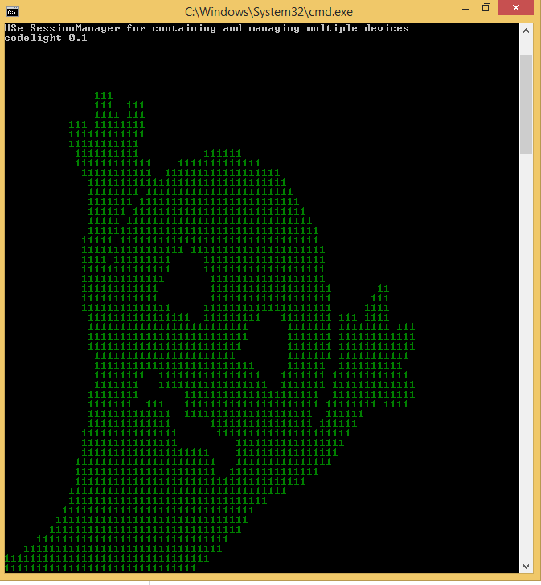

# AndroidSploitAPI
Android Sploit API for Python development on windows or linux both

# Prequisite on Windows

pip install colorama<br>
python main.py<br>
or use com.cosmo.sploit.tools to embed in your own application
# Prequisite on Linux
# Skip adb.rar for Linux
pip install colorama<br>
python3 main.py<br>
or use com.cosmo.sploit.tools to embed in your own application
When you start main.py ask for installing adb if you have already installed press y to continue or n for install
<a href="https://github.com/sonuaryan7644/AndroidSploitAPI.git"> Download</a>
# Welcome to Cosmo
# using Android Sploit API
# Enable debuging mode in developer option
# example start and restart and kill ADB server
```Python
from com.cosmo.sploit.tools import ADB
adb=ADB()
adb.start_server() #start server for perform operation
adb.restart_server() #restart server
adb.kill_server() #kill server
```
# example remove lock-screen !
```Python
from com.cosmo.sploit.tools import Session,ADB
adb=ADB()
adb.start_server()
s=Session("localhost","62001") #  62001 port is only work for Nox 5555 for android devices and enter IP address
s.set_shell_mode(_mode="") # su is used for super user mode use _mode='su' on super user supported device or emulater
s.start_session()
s.remove_screen_lock(s.get_device()) 
adb.kill_server()
```
# Use our CodeLight tools for more interactive code
# Example using CodeLight tool
```Python
from com.cosmo.sploit.codelight.codelighttool import CodeLightTool
cl=CodeLightTool()
cl.start_server()
cl.create_session(_host_ip="localhost",_host_port="62001",_id="1")
cl.bind_active_session("1")
cl.remove_screen_lock()
cl.disconnect_device()
cl.stop_server()
```
# Codelight with ConsoleImage

